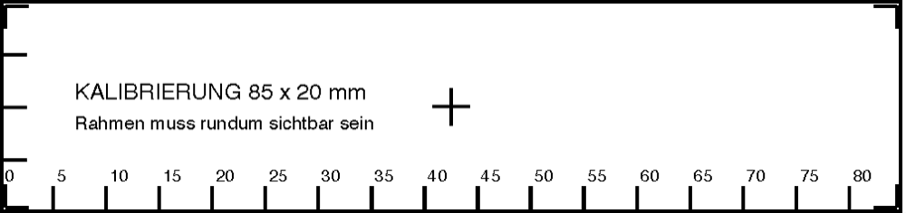
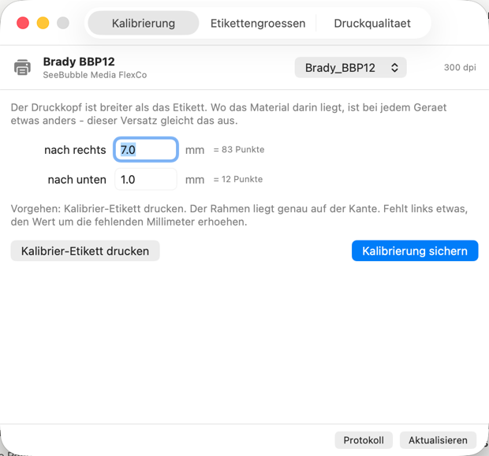
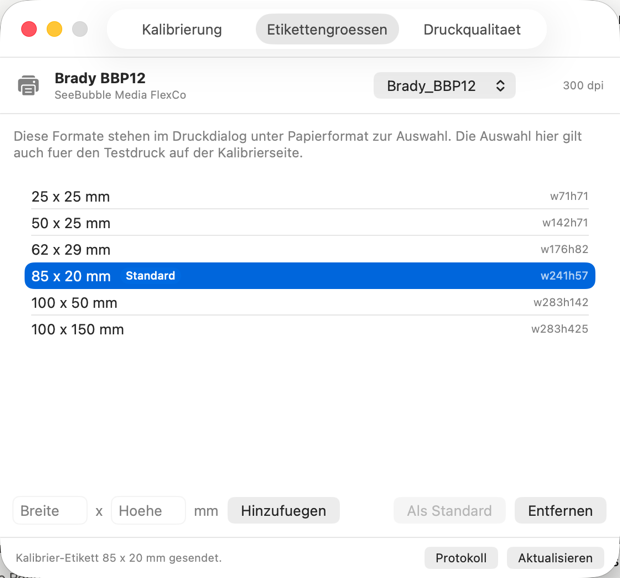

# Brady BBP12 - macOS Druckertreiber (TSPL)

**SeeBubble Media FlexCo - Martin Bundschuh**

[](LICENSE)


Ein eigenstaendiger, quelloffener CUPS-Treiber fuer den **Brady BBP12**
Thermodrucker unter macOS. Er ersetzt den kostenpflichtigen Peninsula-Treiber
und druckt **ohne Wasserzeichen** und ohne Lizenzbeschraenkung.

> **Unabhaengiges Projekt.** Nicht mit der Brady Corporation verbunden, nicht von
> ihr unterstuetzt und nicht von einem kommerziellen Fremdtreiber abgeleitet.
> Der Treiber ist von Grund auf gegen die dokumentierte TSPL-Kommandosprache
> geschrieben. Brady und BBP sind Marken ihrer jeweiligen Inhaber.



## Konfigurationsfenster

Etikettengroessen anlegen, Druckursprung kalibrieren, Qualitaet einstellen,
Testdruck ausloesen -- ohne Terminal.

```
./gui/build.sh
open "build/Brady BBP12 Konfiguration.app"
```

<p>


</p>

Die App ist eine Huelle um die Skripte in `tools/` -- alles, was sie tut, geht
auch auf der Kommandozeile. Fuer privilegierte Schritte (PPD, Konfigurationsdatei)
fragt macOS selbst nach dem Passwort.

## Was der Drucker spricht

Der BBP12 ist ein **300-dpi**-Thermodrucker, der **TSPL** (TSC Printer Language)
versteht.

> Achtung: Das PPD des Peninsula-Treibers gibt "BBP12 200dpi / DPI=203" an.
> Das ist falsch. Mit 203 dpi wird der Druck auf 203/300 = 68 % der Sollgroesse
> gestaucht und deckt nur rund zwei Drittel der Etikettenbreite ab.
> Standard in diesem Treiber ist deshalb 300 dpi; 203 dpi bleibt im Druckdialog
> unter *Resolution* waehlbar, falls dein Geraet doch die 203-dpi-Variante ist. Der Treiber besteht deshalb aus zwei Teilen:

| Teil | Datei | Aufgabe |
|---|---|---|
| CUPS-Rasterfilter | `src/rastertobradybbp12.c` | wandelt CUPS-Raster in TSPL-Befehle (`SIZE`, `GAP`, `DENSITY`, `BITMAP`, `PRINT`) |
| PPD | `ppd/BradyBBP12.ppd` | meldet Auflösung, Etikettenformate und Druckoptionen an macOS |

Der Druckweg ist: App → PDF → `cgpdftoraster` (macOS) → `rastertobradybbp12` → TSPL → USB.

## Installation

### Installationsprogramm (empfohlen)

1. **[BradyBBP12-1.0.pkg](../../releases/latest)** von der Releases-Seite laden
2. Drucker per USB anschliessen und **einschalten**
3. **Rechtsklick auf die .pkg -> Oeffnen** -- einmalig noetig, weil das Paket
   nicht notariell signiert ist. Ein Doppelklick wird sonst von macOS blockiert.
4. Durch das Installationsprogramm klicken, Passwort eingeben

Das Paket bringt den fertig kompilierten Treiber mit -- auf dem Zielrechner
werden **weder Xcode noch ein Compiler** gebraucht. Es installiert:

| | |
|---|---|
| `/Library/Printers/Brady/Filters/` | den CUPS-Filter (universal, Apple Silicon + Intel) |
| `/Library/Printers/PPDs/Contents/Resources/` | das PPD |
| `/Applications/` | **Brady BBP12 Konfiguration.app** |
| `/Library/Printers/Brady/tools/` | die Kommandozeilenwerkzeuge |

Die Warteschlange `Brady_BBP12` wird automatisch angelegt, sobald der Drucker
gefunden wird. Eine **bereits vorhandene** Warteschlange bleibt unangetastet --
sonst gingen selbst angelegte Etikettengroessen verloren.

Danach einmal kalibrieren: `Brady BBP12 Konfiguration` oeffnen, Reiter
*Kalibrierung*, *Kalibrier-Etikett drucken*, den Versatz ablesen und sichern.

### Aus dem Quelltext

```
git clone https://github.com/CodeNinjaGuy/brady-bbp12-macos-driver.git
cd brady-bbp12-macos-driver
sudo ./install.sh
```

Hierfuer werden die **Xcode Command Line Tools** benoetigt (`xcode-select --install`),
weil der Filter vor Ort kompiliert wird.

Anderer Warteschlangenname: `sudo ./install.sh MeinName`

### Installationsprogramm selbst bauen

```
./pkg/build-pkg.sh 1.0
```

### Alte Demo-Warteschlange entfernen

Die vorhandene Peninsula-Queue heißt `BRADYBBP12`:

```
sudo lpadmin -x BRADYBBP12
```

## Deinstallation

```
sudo /Library/Printers/Brady/tools/uninstall.sh
```

Entfernt Warteschlangen, Treiberdateien, die App und die Kalibrierung.

## Erstinbetriebnahme: Auflösung und Ausrichtung pruefen

### 1. Konfigurationsetikett des Druckers

Der Drucker kann seine eigenen Eckdaten ausdrucken -- Modell, dpi, Druckbreite,
Sensoreinstellungen. Das ist die zuverlaessigste Auskunft ueber die Auflösung:

```
./tools/selftest.sh
```

### 2. Kalibrier-Etikett

```
lp -d Brady_BBP12 test/calibration_85x20.pdf
```

Darauf liegt ein Rahmen exakt auf der Etikettenkante, dazu eine
Millimeterskala. Damit laesst sich direkt ablesen, was passiert:

| Beobachtung | Bedeutung | Abhilfe |
|---|---|---|
| Rahmen rundum sichtbar, Skala endet bei 85 | alles korrekt | nichts zu tun |
| Druck fuellt nur ~2/3 der Breite | falsche Auflösung | *Resolution* auf 300 dpi bzw. 203 dpi umstellen |
| Skala beginnt erst bei z. B. 5 statt 0 | Ursprung liegt 5 mm links vom Etikett | `BradyXOffset` = 5 mm x 11.81 = 59 Punkte |
| obere Rahmenlinie fehlt | Ursprung liegt oberhalb des Etiketts | `BradyYOffset` entsprechend erhoehen |

Umrechnung bei 300 dpi: **1 mm = 11,81 Punkte**, bei 203 dpi: 1 mm = 7,99 Punkte.
Im Konfigurationsfenster gibt man einfach Millimeter ein.

Dauerhaft setzen -- in Millimetern, die Umrechnung macht das Skript:

```
sudo ./tools/set-offset.sh 7.0 1.0
```

Die richtigen Werte sind **geraetespezifisch** -- der Druckkopf ist breiter als
das Material, und wo genau das Etikett darin liegt, unterscheidet sich von
Geraet zu Geraet. Deshalb erst das Kalibrier-Etikett drucken, ablesen, setzen.

Das schreibt `/Library/Printers/Brady/bbp12.conf`:

```
BradyXOffset 31
BradyYOffset 12
```

Diese Datei liest der Filter bei jedem Job, aus jeder Anwendung. Ihre Eintraege
gehen bewusst **vor** den Job-Optionen -- der Druckursprung ist eine Eigenschaft
des Geraets, nicht eines einzelnen Auftrags. Andere Optionen (Schwaerzung,
Geschwindigkeit) lassen sich dort genauso festnageln.

> `lpadmin -o BradyXOffset=31` funktioniert dafuer **nicht**: CUPS verwirft
> PPD-Defaults, die nicht in der Auswahlliste des PPD stehen, ohne Fehlermeldung.
> Der Ausdruck bleibt dann unveraendert.

## Druckoptionen

Zu finden unter *Systemeinstellungen → Drucker → Optionen* bzw. im Druckdialog
unter „Brady BBP12 Settings“. Per Kommandozeile mit `lp -o NAME=WERT`.

| Option | Werte | Standard | Bedeutung |
|---|---|---|---|
| `BradyMediaType` | `Gap`, `Continuous`, `BlackMark` | `Gap` | Stanzetiketten / Endlosmaterial / Schwarzmarke |
| `BradyGap` | mm | `3` | Höhe der Lücke bzw. der Schwarzmarke |
| `BradySensorOffset` | mm | `0` | Versatz des Sensors |
| `BradyRibbon` | `On`, `Off` | `On` | Thermotransfer (Farbband) oder Direktthermo |
| `BradyDensity` | `0`–`15` | `8` | Heizstärke / Schwärzung |
| `BradySpeed` | `2`–`5` | `2` | Druckgeschwindigkeit in Zoll/s |
| `BradyDither` | `Threshold`, `Diffusion` | `Threshold` | scharf (Text/Barcode) oder Fehlerdiffusion (Fotos/Logos) |
| `BradyThreshold` | `1`–`254` | `128` | Schwarzschwelle bei `Threshold` |
| `BradyDirection` | `1`, `0` | `1` | Vorschubrichtung, `0` dreht um 180° |
| `BradyMirror` | `0`, `1` | `0` | Spiegelbild |
| `BradyXOffset` / `BradyYOffset` | Punkte | `0` | Feinjustage der Druckposition (1 mm = 11,81 Punkte bei 300 dpi) |
| `Resolution` | `300dpi`, `203dpi` | `300dpi` | Druckkopfauflösung |

Beispiel:

```
lp -d Brady_BBP12 -o BradyDensity=12 -o BradyDither=Diffusion logo.pdf
```

## Etikettenformate

Anlegen und verwalten entweder im Konfigurationsfenster oder direkt:

```
./tools/label-size.py list
sudo ./tools/label-size.py add 62 100
sudo ./tools/label-size.py default w241h57
sudo ./tools/label-size.py remove w71h71
```

Voreingestellt ist **85 x 20 mm** (241 x 57 pt), dazu gibt es 25×25, 50×25,
62×29, 100×50 und 100×150 mm. Beliebige Größen gehen über „Eigene Papiergröße“
im Druckdialog – der Filter übernimmt die Maße automatisch in den
TSPL-`SIZE`-Befehl.

Die maximale Materialbreite steht im PPD auf 108 mm (`*MaxMediaWidth: "306"`).
Falls dein BBP12 einen schmaleren oder breiteren Druckkopf hat, ist das die
einzige Zahl, die anzupassen ist.

## Fehlersuche

Ausführliches Log einschalten und Job absetzen:

```
sudo cupsctl --debug-logging
lp -d Brady_BBP12 datei.pdf
tail -f /var/log/cups/error_log
```

Der Filter meldet dort pro Auftrag die tatsaechlich verwendeten Werte:

```
INFO: Brady BBP12: offset 31,12 dots; density 8; speed 2; media Gap; gap 3 mm
```

Damit laesst sich sofort sehen, ob eine Einstellung ueberhaupt ankommt.

Wieder abschalten mit `sudo cupsctl --no-debug-logging`.

TSPL-Ausgabe ohne Drucker prüfen (schreibt die rohen Befehle in eine Datei):

```
cupsfilter -p ppd/BradyBBP12.ppd -m application/vnd.cups-raster datei.pdf > out.raster
PPD=ppd/BradyBBP12.ppd build/rastertobradybbp12 1 user Test 1 "" out.raster > out.tspl
```


## Aufbau des Projekts

```
src/rastertobradybbp12.c   CUPS-Rasterfilter (Raster -> TSPL)
ppd/BradyBBP12.ppd         Formate und Druckoptionen fuer macOS
install.sh                 kompiliert, installiert, richtet die Queue ein
uninstall.sh               entfernt alles wieder
gui/BradyBBP12Config.swift Konfigurationsfenster (SwiftUI)
gui/build.sh               baut die .app -- kein Xcode-Projekt noetig
pkg/build-pkg.sh           baut das .pkg-Installationsprogramm
pkg/scripts/postinstall    richtet die Warteschlange nach der Installation ein
tools/set-offset.sh        Druckursprung in Millimetern justieren
tools/label-size.py        Etikettengroessen im PPD anlegen/entfernen/als Standard
tools/selftest.sh          Konfigurationsetikett des Druckers anfordern
test/make_calibration.py   erzeugt ein Kalibrier-Etikett beliebiger Groesse
test/make_testlabel.py     erzeugt ein einfaches Testetikett
```

## Mitwirken

Fehlerberichte und Pull Requests sind willkommen. Besonders hilfreich:
bestaetigte Werte fuer andere Brady-Modelle, Druckkopfbreiten und
Etikettenformate.

## Lizenz

MIT -- siehe [LICENSE](LICENSE).

Copyright (c) 2026 SeeBubble Media FlexCo - Martin Bundschuh
